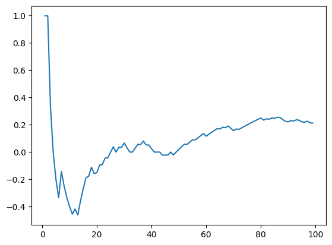

```python
# !poetry run python -m vowpalwabbit -d train.dat --cb_explore 4 --bag 5
import vowpalwabbit

vw = vowpalwabbit.Workspace("--cb_explore 4 --cover 3", quiet=False)
```

    [warning] currently, mtr is only used for the first policy in cover, other policies use dr


    using no cache
    Reading datafile = none
    num sources = 0
    Num weight bits = 18
    learning rate = 0.5
    initial_t = 0
    power_t = 0.5
    cb_type = mtr
    Enabled learners: gd, scorer-identity, csoaa_ldf-rank, cb_adf, cb_explore_adf_cover, shared_feature_merger, cb_to_cbadf
    Input label = CB
    Output pred = ACTION_PROBS
    average  since         example        example        current        current  current
    loss     last          counter         weight          label        predict features
    
    finished run
    number of examples = 198
    weighted example sum = 198.000000
    weighted label sum = 0.000000
    average loss = 0.050505
    total feature number = 3168


```python
use_train = False
if use_train:
    with open("train.dat") as f:
        for line in f:
            line = line.strip()
            print(line)
            vw.learn(line)
```


```python
def sample_custom_pmf(pmf):
    total = sum(pmf)
    scale = 1 / total
    pmf = [x * scale for x in pmf]
    draw = random.random()
    sum_prob = 0.0
    for index, prob in enumerate(pmf):
        sum_prob += prob
        if sum_prob > draw:
            return index, prob
```


```python
def sample_custom_pmf2(pmf):
    action = np.argmax(pmf)
    return action, pmf[action]
```


```python
import random

import numpy as np

while False:
    pmf = vw.predict("| a b c")
    action, probability = sample_custom_pmf(pmf)
    print("showing action:", action + 1)
    value = input("enter y, n or q:")
    if value == "q":
        break
    # Cost must be -tive for positive rewards.
    cost = -1 if value == "y" else 1
    # Action index starts from 1
    vw.learn(f"{action+1}:{cost}:{probability} | a b c")
    print(f"{action+1}:{cost}:{probability} | a b c")
```


```python
import random
from collections import defaultdict

import numpy as np

cost_sum = 0.0
ctr = []
success = defaultdict(int)


for i in range(1, 100):
    pmf = vw.predict("| a b c")
    action, probability = sample_custom_pmf(pmf)
    # Cost must be -tive for positive rewards.
    # cost = -np.random.binomial(1, p=probability)
    cost = -np.random.binomial(1, p=0.6) if action == 0 else 1
    # Action index starts from 1
    success[action] += 1
    vw.learn(f"{action+1}:{cost}:{probability} | a b c")
    print(f"{action+1}:{cost}:{probability} | a b c")
    cost_sum += cost
    ctr.append(-cost_sum / i)
```

    1:-1:0.25 | a b c
    1:-1:0.25 | a b c
    4:1:0.25 | a b c
    3:1:0.25 | a b c
    2:1:0.25 | a b c
    3:1:0.22360678840855394 | a b c
    1:-1:0.3876275958474339 | a b c
    2:1:0.18898224830627441 | a b c
    2:1:0.17677668963705465 | a b c
    3:1:0.16666666915019349 | a b c
    2:1:0.15811387958952963 | a b c
    1:0:0.5477329655806114 | a b c
    4:1:0.14433756900839714 | a b c
    1:-1:0.5839748469587392 | a b c
    1:-1:0.5991081745096911 | a b c
    1:-1:0.6127016635641703 | a b c
    1:0:0.625 | a b c
    1:-1:0.6361965706514631 | a b c
    4:1:0.1178511381149292 | a b c
    1:0:0.6558764029732078 | a b c
    1:-1:0.6645898323811715 | a b c
    1:0:0.6726731953319969 | a b c
    1:-1:0.6801989179879265 | a b c
    1:0:0.6872284053966489 | a b c
    1:-1:0.6938137956424519 | a b c
    1:-1:0.7000000111758703 | a b c
    4:1:0.09805806653158317 | a b c
    1:-1:0.7113248824929896 | a b c
    1:0:0.7165266275405884 | a b c
    1:-1:0.7214569991718456 | a b c
    2:1:0.09128709273468096 | a b c
    3:1:0.08980265527375506 | a b c
    1:0:0.7348349477637159 | a b c
    1:-1:0.7388835063410327 | a b c
    1:-1:0.74275209733105 | a b c
    1:0:0.7464537398083884 | a b c
    1:-1:0.7499999944120646 | a b c
    4:1:0.08219949217289307 | a b c
    1:0:0.7566678693145782 | a b c
    3:1:0.08006407528686019 | a b c
    4:1:0.07905694038378491 | a b c
    1:0:0.76573934452949 | a b c
    1:0:0.7685449524209995 | a b c
    4:1:0.07624928539619914 | a b c
    1:0:0.7738664996385649 | a b c
    1:0:0.7763931924788622 | a b c
    1:-1:0.7788370731646259 | a b c
    3:1:0.07293249340657175 | a b c
    1:-1:0.7834936497136005 | a b c
    1:-1:0.7857142745384147 | a b c
    1:-1:0.7878679700880369 | a b c
    1:-1:0.7899579825261686 | a b c
    1:0:0.7919874250291841 | a b c
    1:-1:0.7939591585239579 | a b c
    1:-1:0.7958758351728817 | a b c
    1:0:0.7977400182667382 | a b c
    1:-1:0.7995540797876537 | a b c
    1:-1:0.8013201593762564 | a b c
    1:-1:0.8030403672969258 | a b c
    4:1:0.06509445898657108 | a b c
    1:-1:0.8063508332248839 | a b c
    1:-1:0.807944685516681 | a b c
    1:-1:0.8094998236224135 | a b c
    1:-1:0.8110177637788321 | a b c
    1:0:0.8125 | a b c
    1:-1:0.8139479039021149 | a b c
    1:0:0.8153627746390056 | a b c
    1:-1:0.8167458128237152 | a b c
    3:1:0.06063390692433282 | a b c
    4:1:0.06019293040899621 | a b c
    1:-1:0.8207156994487074 | a b c
    1:0:0.8219827382937717 | a b c
    1:-1:0.8232233033643184 | a b c
    1:-1:0.8244382874422732 | a b c
    1:-1:0.8256285375124633 | a b c
    1:-1:0.8267949419158166 | a b c
    1:-1:0.8279382021275841 | a b c
    1:-1:0.8290591301698917 | a b c
    1:-1:0.8301584411353453 | a b c
    1:-1:0.8312368114250477 | a b c
    2:1:0.0559016966856384 | a b c
    1:-1:0.8333333389212686 | a b c
    1:0:0.8343527192718876 | a b c
    1:-1:0.8353536066759109 | a b c
    1:0:0.8363365940078363 | a b c
    1:-1:0.837302161158873 | a b c
    1:0:0.838250844245745 | a b c
    3:1:0.05360562866642848 | a b c
    4:1:0.053300179938228276 | a b c
    1:0:0.8410003153942514 | a b c
    1:-1:0.8418861219863609 | a b c
    1:0:0.8427572752688691 | a b c
    1:-1:0.8436141986202471 | a b c
    1:0:0.8444572498398143 | a b c
    4:1:0.051571058627227655 | a b c
    1:0:0.8461032418074156 | a b c
    1:-1:0.8469068972509097 | a b c
    4:1:0.050767305671044004 | a b c
    1:0:0.8484771188461995 | a b c


    n.a.     n.a.                1            1.0        unknown         0:0.25       16
    -1.00000 -1.00000            2            2.0      0:-1:0.25         0:0.25       16
    -1.00000 -1.00000            4            4.0      0:-1:0.25         0:0.25       16
    0.000000 1.000000            8            8.0       2:1:0.25         0:0.25       16
    0.250000 0.500000           16           16.0       1:1:0.19         0:0.43       16
    0.187500 0.125000           32           32.0      0:-1:0.61         0:0.61       16
    -0.00000 -0.18750           64           64.0       2:1:0.09         0:0.73       16
    -0.17187 -0.34375          128          128.0      0:-1:0.81         0:0.81       16


```python
import matplotlib.pyplot as plt

plt.plot(range(1, 100), ctr)
```


    [<matplotlib.lines.Line2D at 0x11bc99b40>]


    

    


```python
success
```


    defaultdict(int, {0: 73, 3: 12, 2: 8, 1: 6})


```python
cost_sum
```


    -21.0


