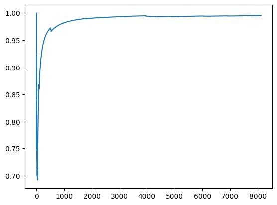

```python
from ucimlrepo import fetch_ucirepo

# fetch dataset
mushroom = fetch_ucirepo(id=73)

# data (as pandas dataframes)
X = mushroom.data.features
y = mushroom.data.targets
X.shape, y.shape
```


    ((8124, 22), (8124, 1))


```python
X.head().T
```


<div>
<style scoped>
    .dataframe tbody tr th:only-of-type {
        vertical-align: middle;
    }

    .dataframe tbody tr th {
        vertical-align: top;
    }

    .dataframe thead th {
        text-align: right;
    }
</style>
<table border="1" class="dataframe">
  <thead>
    <tr style="text-align: right;">
      <th></th>
      <th>0</th>
      <th>1</th>
      <th>2</th>
      <th>3</th>
      <th>4</th>
    </tr>
  </thead>
  <tbody>
    <tr>
      <th>cap-shape</th>
      <td>x</td>
      <td>x</td>
      <td>b</td>
      <td>x</td>
      <td>x</td>
    </tr>
    <tr>
      <th>cap-surface</th>
      <td>s</td>
      <td>s</td>
      <td>s</td>
      <td>y</td>
      <td>s</td>
    </tr>
    <tr>
      <th>cap-color</th>
      <td>n</td>
      <td>y</td>
      <td>w</td>
      <td>w</td>
      <td>g</td>
    </tr>
    <tr>
      <th>bruises</th>
      <td>t</td>
      <td>t</td>
      <td>t</td>
      <td>t</td>
      <td>f</td>
    </tr>
    <tr>
      <th>odor</th>
      <td>p</td>
      <td>a</td>
      <td>l</td>
      <td>p</td>
      <td>n</td>
    </tr>
    <tr>
      <th>gill-attachment</th>
      <td>f</td>
      <td>f</td>
      <td>f</td>
      <td>f</td>
      <td>f</td>
    </tr>
    <tr>
      <th>gill-spacing</th>
      <td>c</td>
      <td>c</td>
      <td>c</td>
      <td>c</td>
      <td>w</td>
    </tr>
    <tr>
      <th>gill-size</th>
      <td>n</td>
      <td>b</td>
      <td>b</td>
      <td>n</td>
      <td>b</td>
    </tr>
    <tr>
      <th>gill-color</th>
      <td>k</td>
      <td>k</td>
      <td>n</td>
      <td>n</td>
      <td>k</td>
    </tr>
    <tr>
      <th>stalk-shape</th>
      <td>e</td>
      <td>e</td>
      <td>e</td>
      <td>e</td>
      <td>t</td>
    </tr>
    <tr>
      <th>stalk-root</th>
      <td>e</td>
      <td>c</td>
      <td>c</td>
      <td>e</td>
      <td>e</td>
    </tr>
    <tr>
      <th>stalk-surface-above-ring</th>
      <td>s</td>
      <td>s</td>
      <td>s</td>
      <td>s</td>
      <td>s</td>
    </tr>
    <tr>
      <th>stalk-surface-below-ring</th>
      <td>s</td>
      <td>s</td>
      <td>s</td>
      <td>s</td>
      <td>s</td>
    </tr>
    <tr>
      <th>stalk-color-above-ring</th>
      <td>w</td>
      <td>w</td>
      <td>w</td>
      <td>w</td>
      <td>w</td>
    </tr>
    <tr>
      <th>stalk-color-below-ring</th>
      <td>w</td>
      <td>w</td>
      <td>w</td>
      <td>w</td>
      <td>w</td>
    </tr>
    <tr>
      <th>veil-type</th>
      <td>p</td>
      <td>p</td>
      <td>p</td>
      <td>p</td>
      <td>p</td>
    </tr>
    <tr>
      <th>veil-color</th>
      <td>w</td>
      <td>w</td>
      <td>w</td>
      <td>w</td>
      <td>w</td>
    </tr>
    <tr>
      <th>ring-number</th>
      <td>o</td>
      <td>o</td>
      <td>o</td>
      <td>o</td>
      <td>o</td>
    </tr>
    <tr>
      <th>ring-type</th>
      <td>p</td>
      <td>p</td>
      <td>p</td>
      <td>p</td>
      <td>e</td>
    </tr>
    <tr>
      <th>spore-print-color</th>
      <td>k</td>
      <td>n</td>
      <td>n</td>
      <td>k</td>
      <td>n</td>
    </tr>
    <tr>
      <th>population</th>
      <td>s</td>
      <td>n</td>
      <td>n</td>
      <td>s</td>
      <td>a</td>
    </tr>
    <tr>
      <th>habitat</th>
      <td>u</td>
      <td>g</td>
      <td>m</td>
      <td>u</td>
      <td>g</td>
    </tr>
  </tbody>
</table>
</div>


```python
# metadata
import json

print(json.dumps(mushroom.metadata, indent=2))
```

    {
      "uci_id": 73,
      "name": "Mushroom",
      "repository_url": "https://archive.ics.uci.edu/dataset/73/mushroom",
      "data_url": "https://archive.ics.uci.edu/static/public/73/data.csv",
      "abstract": "From Audobon Society Field Guide; mushrooms described in terms of physical characteristics; classification: poisonous or edible",
      "area": "Biology",
      "tasks": [
        "Classification"
      ],
      "characteristics": [
        "Multivariate"
      ],
      "num_instances": 8124,
      "num_features": 22,
      "feature_types": [
        "Categorical"
      ],
      "demographics": [],
      "target_col": [
        "poisonous"
      ],
      "index_col": null,
      "has_missing_values": "yes",
      "missing_values_symbol": "NaN",
      "year_of_dataset_creation": 1981,
      "last_updated": "Thu Aug 10 2023",
      "dataset_doi": "10.24432/C5959T",
      "creators": [],
      "intro_paper": null,
      "additional_info": {
        "summary": "This data set includes descriptions of hypothetical samples corresponding to 23 species of gilled mushrooms in the Agaricus and Lepiota Family (pp. 500-525).  Each species is identified as definitely edible, definitely poisonous, or of unknown edibility and not recommended.  This latter class was combined with the poisonous one.  The Guide clearly states that there is no simple rule for determining the edibility of a mushroom; no rule like ``leaflets three, let it be'' for Poisonous Oak and Ivy.",
        "purpose": null,
        "funded_by": null,
        "instances_represent": null,
        "recommended_data_splits": null,
        "sensitive_data": null,
        "preprocessing_description": null,
        "variable_info": "     1. cap-shape:                bell=b,conical=c,convex=x,flat=f, knobbed=k,sunken=s\r\n     2. cap-surface:              fibrous=f,grooves=g,scaly=y,smooth=s\r\n     3. cap-color:                brown=n,buff=b,cinnamon=c,gray=g,green=r, pink=p,purple=u,red=e,white=w,yellow=y\r\n     4. bruises?:                 bruises=t,no=f\r\n     5. odor:                     almond=a,anise=l,creosote=c,fishy=y,foul=f, musty=m,none=n,pungent=p,spicy=s\r\n     6. gill-attachment:          attached=a,descending=d,free=f,notched=n\r\n     7. gill-spacing:             close=c,crowded=w,distant=d\r\n     8. gill-size:                broad=b,narrow=n\r\n     9. gill-color:               black=k,brown=n,buff=b,chocolate=h,gray=g, green=r,orange=o,pink=p,purple=u,red=e, white=w,yellow=y\r\n    10. stalk-shape:              enlarging=e,tapering=t\r\n    11. stalk-root:               bulbous=b,club=c,cup=u,equal=e, rhizomorphs=z,rooted=r,missing=?\r\n    12. stalk-surface-above-ring: fibrous=f,scaly=y,silky=k,smooth=s\r\n    13. stalk-surface-below-ring: fibrous=f,scaly=y,silky=k,smooth=s\r\n    14. stalk-color-above-ring:   brown=n,buff=b,cinnamon=c,gray=g,orange=o, pink=p,red=e,white=w,yellow=y\r\n    15. stalk-color-below-ring:   brown=n,buff=b,cinnamon=c,gray=g,orange=o, pink=p,red=e,white=w,yellow=y\r\n    16. veil-type:                partial=p,universal=u\r\n    17. veil-color:               brown=n,orange=o,white=w,yellow=y\r\n    18. ring-number:              none=n,one=o,two=t\r\n    19. ring-type:                cobwebby=c,evanescent=e,flaring=f,large=l, none=n,pendant=p,sheathing=s,zone=z\r\n    20. spore-print-color:        black=k,brown=n,buff=b,chocolate=h,green=r, orange=o,purple=u,white=w,yellow=y\r\n    21. population:               abundant=a,clustered=c,numerous=n, scattered=s,several=v,solitary=y\r\n    22. habitat:                  grasses=g,leaves=l,meadows=m,paths=p, urban=u,waste=w,woods=d",
        "citation": null
      }
    }


```python
print(mushroom.metadata["additional_info"]["variable_info"])
```

         1. cap-shape:                bell=b,conical=c,convex=x,flat=f, knobbed=k,sunken=s
         2. cap-surface:              fibrous=f,grooves=g,scaly=y,smooth=s
         3. cap-color:                brown=n,buff=b,cinnamon=c,gray=g,green=r, pink=p,purple=u,red=e,white=w,yellow=y
         4. bruises?:                 bruises=t,no=f
         5. odor:                     almond=a,anise=l,creosote=c,fishy=y,foul=f, musty=m,none=n,pungent=p,spicy=s
         6. gill-attachment:          attached=a,descending=d,free=f,notched=n
         7. gill-spacing:             close=c,crowded=w,distant=d
         8. gill-size:                broad=b,narrow=n
         9. gill-color:               black=k,brown=n,buff=b,chocolate=h,gray=g, green=r,orange=o,pink=p,purple=u,red=e, white=w,yellow=y
        10. stalk-shape:              enlarging=e,tapering=t
        11. stalk-root:               bulbous=b,club=c,cup=u,equal=e, rhizomorphs=z,rooted=r,missing=?
        12. stalk-surface-above-ring: fibrous=f,scaly=y,silky=k,smooth=s
        13. stalk-surface-below-ring: fibrous=f,scaly=y,silky=k,smooth=s
        14. stalk-color-above-ring:   brown=n,buff=b,cinnamon=c,gray=g,orange=o, pink=p,red=e,white=w,yellow=y
        15. stalk-color-below-ring:   brown=n,buff=b,cinnamon=c,gray=g,orange=o, pink=p,red=e,white=w,yellow=y
        16. veil-type:                partial=p,universal=u
        17. veil-color:               brown=n,orange=o,white=w,yellow=y
        18. ring-number:              none=n,one=o,two=t
        19. ring-type:                cobwebby=c,evanescent=e,flaring=f,large=l, none=n,pendant=p,sheathing=s,zone=z
        20. spore-print-color:        black=k,brown=n,buff=b,chocolate=h,green=r, orange=o,purple=u,white=w,yellow=y
        21. population:               abundant=a,clustered=c,numerous=n, scattered=s,several=v,solitary=y
        22. habitat:                  grasses=g,leaves=l,meadows=m,paths=p, urban=u,waste=w,woods=d


```python
# variable information
print(mushroom.variables)
```

                            name     role         type demographic  \
    0                  poisonous   Target  Categorical        None   
    1                  cap-shape  Feature  Categorical        None   
    2                cap-surface  Feature  Categorical        None   
    3                  cap-color  Feature       Binary        None   
    4                    bruises  Feature  Categorical        None   
    5                       odor  Feature  Categorical        None   
    6            gill-attachment  Feature  Categorical        None   
    7               gill-spacing  Feature  Categorical        None   
    8                  gill-size  Feature  Categorical        None   
    9                 gill-color  Feature  Categorical        None   
    10               stalk-shape  Feature  Categorical        None   
    11                stalk-root  Feature  Categorical        None   
    12  stalk-surface-above-ring  Feature  Categorical        None   
    13  stalk-surface-below-ring  Feature  Categorical        None   
    14    stalk-color-above-ring  Feature  Categorical        None   
    15    stalk-color-below-ring  Feature  Categorical        None   
    16                 veil-type  Feature       Binary        None   
    17                veil-color  Feature  Categorical        None   
    18               ring-number  Feature  Categorical        None   
    19                 ring-type  Feature  Categorical        None   
    20         spore-print-color  Feature  Categorical        None   
    21                population  Feature  Categorical        None   
    22                   habitat  Feature  Categorical        None   
    
                                              description units missing_values  
    0                                                None  None             no  
    1   bell=b,conical=c,convex=x,flat=f, knobbed=k,su...  None             no  
    2                fibrous=f,grooves=g,scaly=y,smooth=s  None             no  
    3   brown=n,buff=b,cinnamon=c,gray=g,green=r, pink...  None             no  
    4                                      bruises=t,no=f  None             no  
    5   almond=a,anise=l,creosote=c,fishy=y,foul=f, mu...  None             no  
    6            attached=a,descending=d,free=f,notched=n  None             no  
    7                         close=c,crowded=w,distant=d  None             no  
    8                                    broad=b,narrow=n  None             no  
    9   black=k,brown=n,buff=b,chocolate=h,gray=g, gre...  None             no  
    10                             enlarging=e,tapering=t  None             no  
    11  bulbous=b,club=c,cup=u,equal=e, rhizomorphs=z,...  None            yes  
    12                 fibrous=f,scaly=y,silky=k,smooth=s  None             no  
    13                 fibrous=f,scaly=y,silky=k,smooth=s  None             no  
    14  brown=n,buff=b,cinnamon=c,gray=g,orange=o, pin...  None             no  
    15  brown=n,buff=b,cinnamon=c,gray=g,orange=o, pin...  None             no  
    16                              partial=p,universal=u  None             no  
    17                  brown=n,orange=o,white=w,yellow=y  None             no  
    18                                 none=n,one=o,two=t  None             no  
    19  cobwebby=c,evanescent=e,flaring=f,large=l, non...  None             no  
    20  black=k,brown=n,buff=b,chocolate=h,green=r, or...  None             no  
    21  abundant=a,clustered=c,numerous=n, scattered=s...  None             no  
    22  grasses=g,leaves=l,meadows=m,paths=p, urban=u,...  None             no  


```python
y.head()
```


<div>
<style scoped>
    .dataframe tbody tr th:only-of-type {
        vertical-align: middle;
    }

    .dataframe tbody tr th {
        vertical-align: top;
    }

    .dataframe thead th {
        text-align: right;
    }
</style>
<table border="1" class="dataframe">
  <thead>
    <tr style="text-align: right;">
      <th></th>
      <th>poisonous</th>
    </tr>
  </thead>
  <tbody>
    <tr>
      <th>0</th>
      <td>p</td>
    </tr>
    <tr>
      <th>1</th>
      <td>e</td>
    </tr>
    <tr>
      <th>2</th>
      <td>e</td>
    </tr>
    <tr>
      <th>3</th>
      <td>p</td>
    </tr>
    <tr>
      <th>4</th>
      <td>e</td>
    </tr>
  </tbody>
</table>
</div>


```python
import pandas as pd
```


```python
df = pd.concat([X, y], axis="columns")
df.head()
```


<div>
<style scoped>
    .dataframe tbody tr th:only-of-type {
        vertical-align: middle;
    }

    .dataframe tbody tr th {
        vertical-align: top;
    }

    .dataframe thead th {
        text-align: right;
    }
</style>
<table border="1" class="dataframe">
  <thead>
    <tr style="text-align: right;">
      <th></th>
      <th>cap-shape</th>
      <th>cap-surface</th>
      <th>cap-color</th>
      <th>bruises</th>
      <th>odor</th>
      <th>gill-attachment</th>
      <th>gill-spacing</th>
      <th>gill-size</th>
      <th>gill-color</th>
      <th>stalk-shape</th>
      <th>...</th>
      <th>stalk-color-above-ring</th>
      <th>stalk-color-below-ring</th>
      <th>veil-type</th>
      <th>veil-color</th>
      <th>ring-number</th>
      <th>ring-type</th>
      <th>spore-print-color</th>
      <th>population</th>
      <th>habitat</th>
      <th>poisonous</th>
    </tr>
  </thead>
  <tbody>
    <tr>
      <th>0</th>
      <td>x</td>
      <td>s</td>
      <td>n</td>
      <td>t</td>
      <td>p</td>
      <td>f</td>
      <td>c</td>
      <td>n</td>
      <td>k</td>
      <td>e</td>
      <td>...</td>
      <td>w</td>
      <td>w</td>
      <td>p</td>
      <td>w</td>
      <td>o</td>
      <td>p</td>
      <td>k</td>
      <td>s</td>
      <td>u</td>
      <td>p</td>
    </tr>
    <tr>
      <th>1</th>
      <td>x</td>
      <td>s</td>
      <td>y</td>
      <td>t</td>
      <td>a</td>
      <td>f</td>
      <td>c</td>
      <td>b</td>
      <td>k</td>
      <td>e</td>
      <td>...</td>
      <td>w</td>
      <td>w</td>
      <td>p</td>
      <td>w</td>
      <td>o</td>
      <td>p</td>
      <td>n</td>
      <td>n</td>
      <td>g</td>
      <td>e</td>
    </tr>
    <tr>
      <th>2</th>
      <td>b</td>
      <td>s</td>
      <td>w</td>
      <td>t</td>
      <td>l</td>
      <td>f</td>
      <td>c</td>
      <td>b</td>
      <td>n</td>
      <td>e</td>
      <td>...</td>
      <td>w</td>
      <td>w</td>
      <td>p</td>
      <td>w</td>
      <td>o</td>
      <td>p</td>
      <td>n</td>
      <td>n</td>
      <td>m</td>
      <td>e</td>
    </tr>
    <tr>
      <th>3</th>
      <td>x</td>
      <td>y</td>
      <td>w</td>
      <td>t</td>
      <td>p</td>
      <td>f</td>
      <td>c</td>
      <td>n</td>
      <td>n</td>
      <td>e</td>
      <td>...</td>
      <td>w</td>
      <td>w</td>
      <td>p</td>
      <td>w</td>
      <td>o</td>
      <td>p</td>
      <td>k</td>
      <td>s</td>
      <td>u</td>
      <td>p</td>
    </tr>
    <tr>
      <th>4</th>
      <td>x</td>
      <td>s</td>
      <td>g</td>
      <td>f</td>
      <td>n</td>
      <td>f</td>
      <td>w</td>
      <td>b</td>
      <td>k</td>
      <td>t</td>
      <td>...</td>
      <td>w</td>
      <td>w</td>
      <td>p</td>
      <td>w</td>
      <td>o</td>
      <td>e</td>
      <td>n</td>
      <td>a</td>
      <td>g</td>
      <td>e</td>
    </tr>
  </tbody>
</table>
<p>5 rows × 23 columns</p>
</div>


```python
from sklearn.feature_extraction import FeatureHasher
from sklearn.neural_network import MLPRegressor
```


```python
# We set alternate sign to false because we want positive numbers only.
# This is important for the training to avoid -tive predictions.
hasher = FeatureHasher(n_features=100, input_type="string", alternate_sign=True)


def preprocess(state, action):
    features = [f"{key}:{value}^{action}" for key, value in state.items()]
    # features = [f"{key}:{value}" for key, value in state.items()]
    # features += [action]
    # print(features)
    return hasher.transform([features]).toarray()[0]
```


```python
X_i = df.iloc[0, :-1]
y_i = df.iloc[0, -1:]
preprocess(X_i, "eat"), preprocess(X_i, "throw"), y_i
```


    (array([ 1.,  0.,  0., -1., -2.,  0.,  0.,  0., -1.,  0.,  0.,  0.,  0.,
             0.,  0.,  0.,  0.,  0.,  0.,  0.,  0.,  0.,  0.,  0.,  0.,  1.,
             0.,  0.,  0.,  0.,  0.,  0.,  0.,  0., -1.,  0., -1.,  0.,  0.,
            -1.,  0.,  0.,  0.,  0.,  1.,  0.,  0.,  0.,  0.,  0.,  0.,  1.,
             0.,  0.,  0.,  0.,  0.,  2.,  0.,  0.,  0.,  0.,  0.,  0.,  0.,
             0.,  0.,  0.,  0.,  0.,  0., -1.,  0.,  0.,  0.,  0.,  0.,  0.,
            -1.,  0.,  0.,  0.,  0., -1.,  0.,  0.,  0.,  0.,  0.,  0.,  0.,
             0.,  0.,  1., -1.,  0.,  0.,  0.,  0.,  0.]),
     array([ 0.,  0.,  0.,  1.,  1.,  1.,  0.,  0.,  0.,  0.,  0.,  0.,  0.,
             0.,  0.,  0.,  0.,  0.,  0.,  0.,  0.,  0.,  0.,  0.,  0.,  0.,
             0.,  0.,  0.,  0.,  0.,  0.,  0.,  0.,  0.,  0.,  0.,  0.,  0.,
             0., -1.,  0.,  0.,  0.,  0.,  0.,  0.,  0.,  0.,  1.,  1.,  0.,
             0.,  1.,  0.,  0.,  0.,  0., -1.,  0.,  1.,  0.,  0.,  1.,  0.,
             0.,  0.,  0.,  0.,  0.,  0., -1.,  0., -1.,  0.,  0.,  1.,  0.,
             0.,  0.,  0.,  0.,  0., -1.,  0.,  2.,  0.,  0.,  0., -2.,  0.,
             0.,  0.,  0.,  0.,  0.,  0.,  0.,  0.,  0.]),
     poisonous    p
     Name: 0, dtype: object)


The MLPRegressor in Scikit-learn does not have a built-in way to restrict the output to non-negative values. However, there are a few workarounds you can use:

1. **Post-processing**: After getting the predictions, you can simply set all negative values to zero. This is the simplest method, but it might not be the best solution if a large number of your predictions are negative.

```python
predictions = model.predict(X)
predictions = np.maximum(predictions, 0)
```

2. **Log transformation**: If your target variable is always positive, you can take the log of the target variable during training, and then exponentiate the predictions. This will ensure that your predictions are always positive.

```python
# During training
model.fit(X, np.log1p(y))

# During prediction
predictions = np.expm1(model.predict(X))
```

Note: `np.log1p(y)` is used instead of `np.log(y)` to handle the case where `y` is 0, and `np.expm1(predictions)` is the inverse of `np.log1p(y)`.

Remember that these are just workarounds. If your model is predicting a lot of negative values and it shouldn't be, it might be a sign that your model isn't well-suited to your data.


```python
def softmax(lst, tau=1.0):
    lst = np.array(lst) / tau
    """The softmax function is often used in machine learning to convert a list of real numbers into a list of probabilities that add up to 1.
    Note: The softmax function can be unstable if the numbers in the list are very large (due to the exponential function). In practice, a common technique is to subtract the maximum value in the list from all the values to stabilize the computation.
    """
    exps = np.exp(lst)
    return exps / np.sum(exps)
```


```python
from collections import defaultdict

import numpy as np

actions = ["eat", "throw"]
total_reward = 0
avg_rewards = []
choices = defaultdict(int)

n = 100
last_n_actions = [""] * n
last_n_probabilities = [[0, 0] for i in range(n)]
POISONOUS = "p"

model = MLPRegressor(
    random_state=42,
)

for i, item in df.iterrows():
    X_i, y_i = item.iloc[:-1], item.iloc[-1]

    if i == 0:
        action = np.random.choice(actions)
    else:
        rewards = model.predict([preprocess(X_i, action) for action in actions])
        action = actions[np.argmax(rewards)]
        p = softmax(rewards, tau=0.2)
        # action = np.random.choice(actions, p=p)
        last_n_probabilities[i % n] = p

    if action == "eat":
        reward = 0 if y_i == POISONOUS else 1
    else:
        reward = 1 if y_i == POISONOUS else 0

    model.partial_fit([preprocess(X_i, action)], [reward])

    choices[action + "_" + y_i] += 1
    last_n_actions[i % n] = action + "_" + y_i
    total_reward += reward
    avg_rewards.append(total_reward / (i + 1))
```


```python
import matplotlib.pyplot as plt

n, _ = df.shape
plt.plot(range(n), avg_rewards)
```


    [<matplotlib.lines.Line2D at 0x121c1c850>]


    

    


```python
total_reward
```


    8086


```python
choices
```


    defaultdict(int, {'throw_p': 3896, 'eat_e': 4190, 'eat_p': 20, 'throw_e': 18})


```python
df["poisonous"].value_counts(), df.shape
```


    (poisonous
     e    4208
     p    3916
     Name: count, dtype: int64,
     (8124, 23))


```python
from collections import Counter

Counter(last_n_actions)
```


    Counter({'eat_e': 54, 'throw_p': 46})


```python
list(zip(last_n_actions[-10:], last_n_probabilities[-10:]))
```


    [('throw_p', array([0.04190506, 0.95809494])),
     ('throw_p', array([0.0294244, 0.9705756])),
     ('throw_p', array([0.02187761, 0.97812239])),
     ('throw_p', array([0.04606314, 0.95393686])),
     ('eat_e', array([0.96843428, 0.03156572])),
     ('throw_p', array([0.1371993, 0.8628007])),
     ('eat_e', array([0.93443274, 0.06556726])),
     ('throw_p', array([0.01341728, 0.98658272])),
     ('throw_p', array([0.02796642, 0.97203358])),
     ('eat_e', array([0.92092305, 0.07907695]))]


```python

```


```python

```
