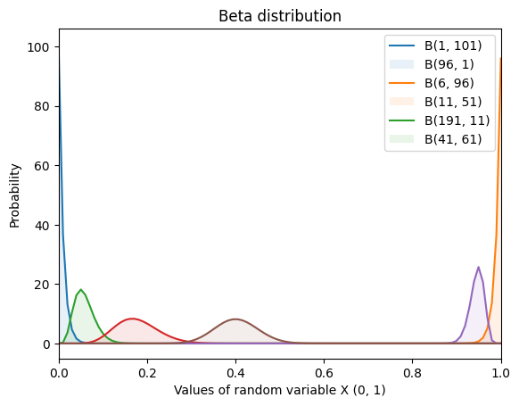
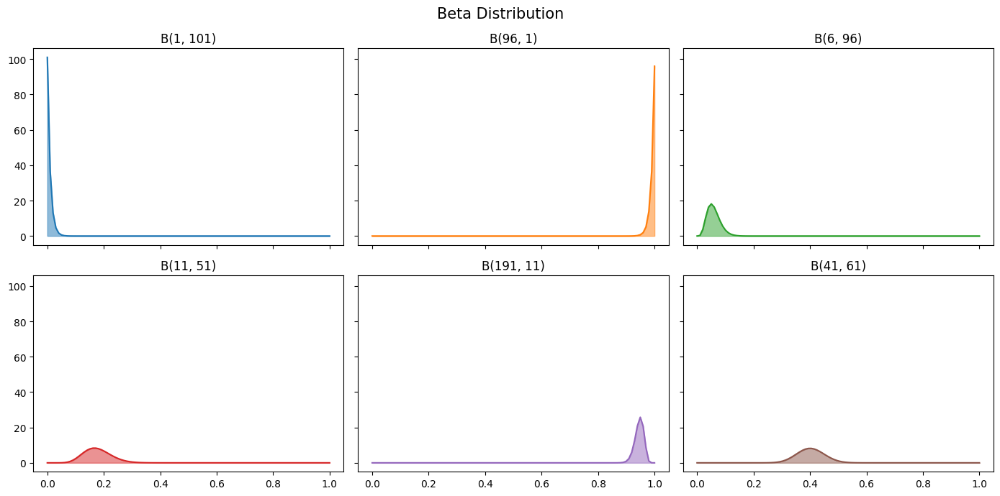

# Beta Distribution


```python
import numpy as np
import matplotlib.pyplot as plt
from scipy.stats import beta
```


```python
# Set the shape parameter.
betas = [
    (0, 100),
    (95, 0),
    (5, 95),
    (10, 50),
    (190, 10),
    (40, 60),
]

# Generate the value between.
X = np.linspace(0, 1, 100)
for a, b in betas:
    pdf = beta.pdf(X, 1+a, 1+b)
    plt.plot(X, pdf)
    plt.fill_between(X, 0, pdf, alpha=0.1)
plt.xlim(0, 1)
plt.title('Beta distribution')
plt.xlabel('Values of random variable X (0, 1)')
plt.ylabel('Probability')
plt.legend([f'B({a+1}, {b+1})' for a, b in betas])
```


    <matplotlib.legend.Legend at 0x11d3694b0>


    

    


```python
fig, axs = plt.subplots(figsize=(14, 7), nrows=2, ncols=3, sharex=True, sharey=True) # 2 rows and 3 cols
fig.suptitle('Beta Distribution', fontsize=15)

# Randomize the color for each subplots.
colors = plt.rcParams["axes.prop_cycle"]()

for i in range(len(betas)):
    r, c = i // 3, i % 3
    a, b = betas[i]
    plt_i = axs[r, c]
    
    c = next(colors)["color"]
    
    pdf = beta.pdf(X, 1+a, 1+b)
    plt_i.plot(x, pdf, c=c)
    plt_i.fill_between(x, 0, pdf, alpha=0.5, color=c)
    plt_i.set_title(f'B({a+1}, {b+1})')

# Hide x labels and tick labels for top plots and y ticks for right plots.
for ax in axs.flat:
    ax.label_outer()

plt.tight_layout()
```


    

    


```python

```
