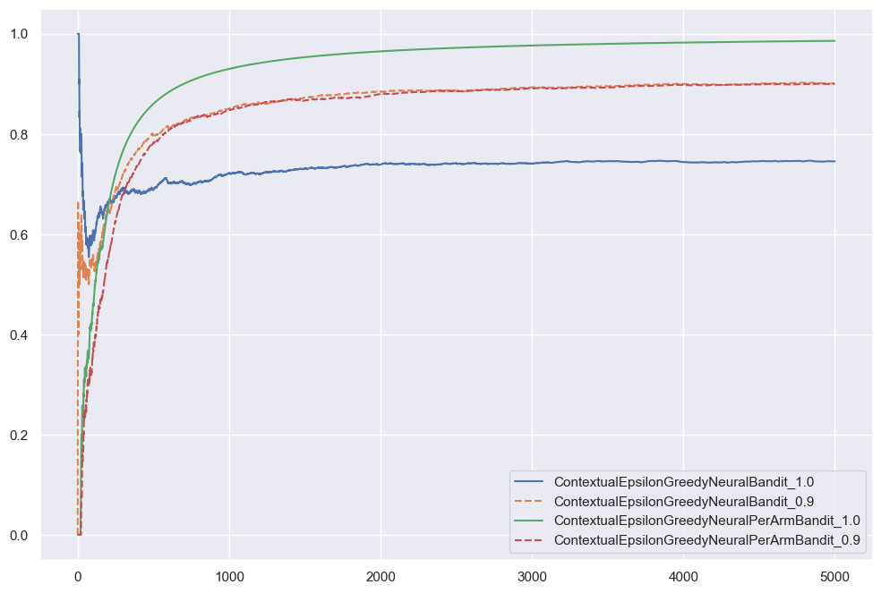
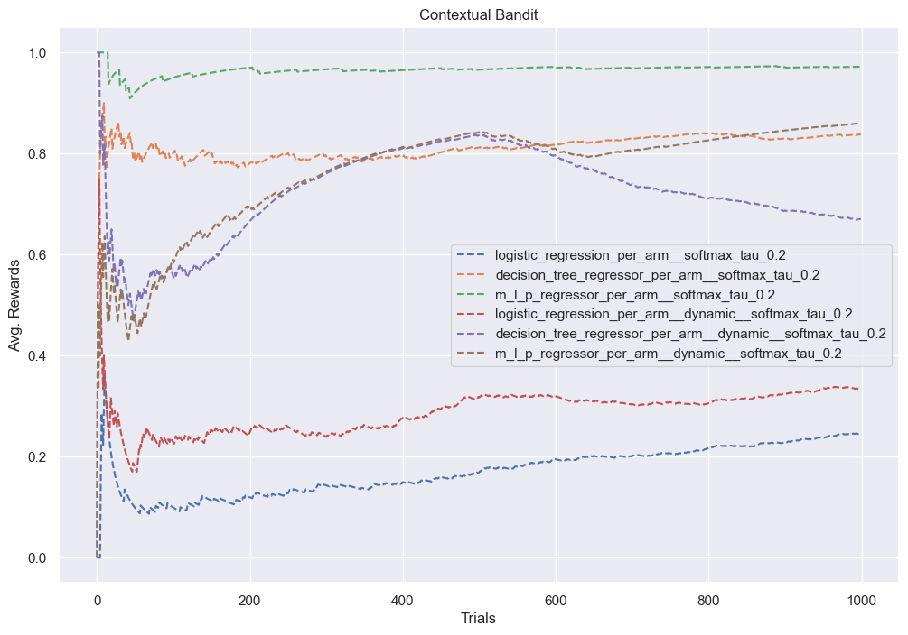
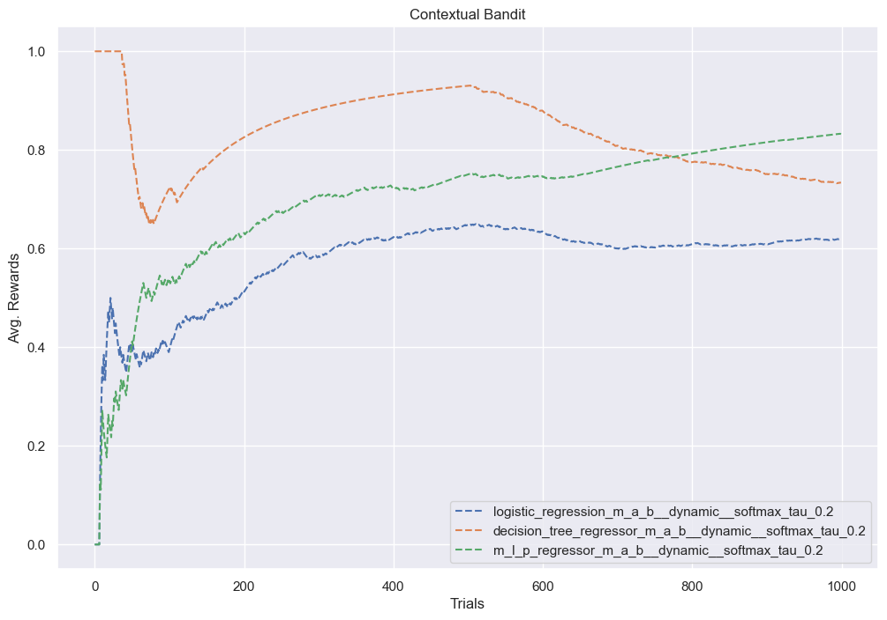
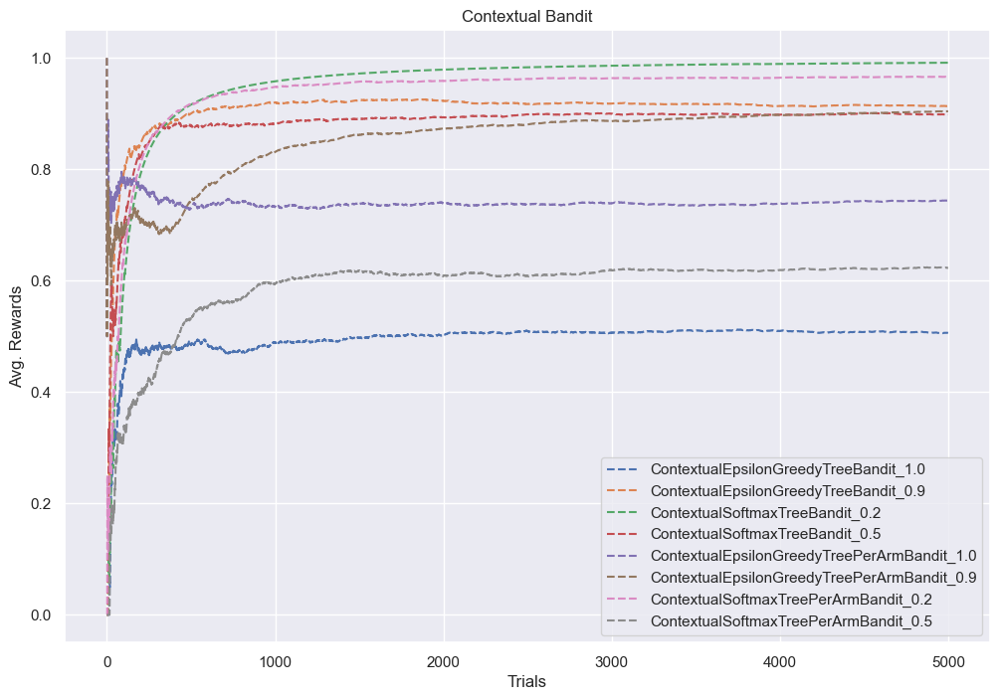
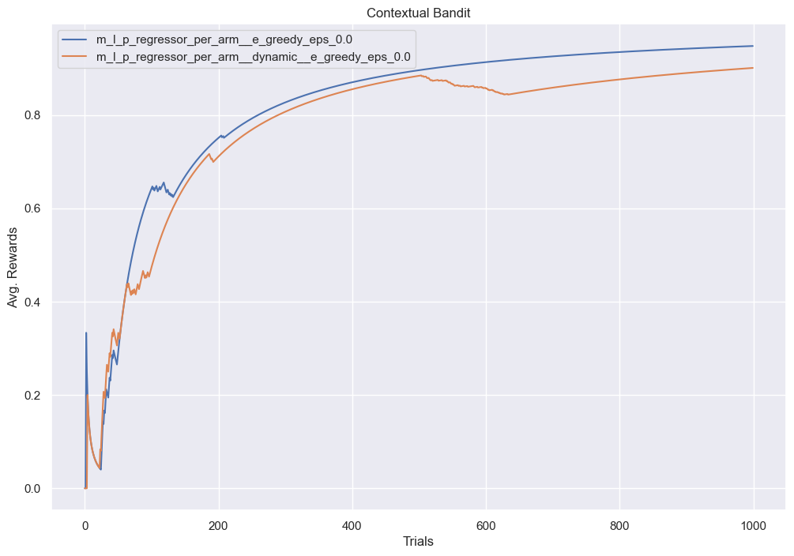
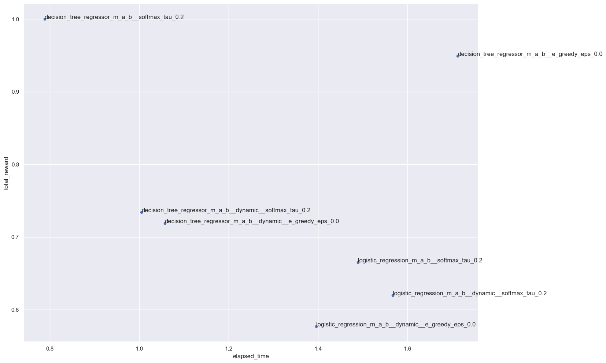

```python
import os
from itertools import product
from timeit import default_timer as timer

import numpy as np
import pandas as pd
import seaborn as sns
from sklearn.linear_model import LogisticRegression
from sklearn.neural_network import MLPRegressor
from sklearn.tree import DecisionTreeRegressor
from tqdm.autonotebook import tqdm

import bandit.environment as env
from bandit.bandit import Bandit, PerArmBandit
from bandit.policy import EGreedy, Softmax
from bandit.utils import snapshot

sns.set_theme()
```

    /var/folders/7m/74_ct3hx33d878n626w1wxyc0000gn/T/ipykernel_95461/1555042788.py:6: DeprecationWarning: 
    Pyarrow will become a required dependency of pandas in the next major release of pandas (pandas 3.0),
    (to allow more performant data types, such as the Arrow string type, and better interoperability with other libraries)
    but was not found to be installed on your system.
    If this would cause problems for you,
    please provide us feedback at https://github.com/pandas-dev/pandas/issues/54466
            
      import pandas as pd
    /var/folders/7m/74_ct3hx33d878n626w1wxyc0000gn/T/ipykernel_95461/1555042788.py:11: TqdmWarning: IProgress not found. Please update jupyter and ipywidgets. See https://ipywidgets.readthedocs.io/en/stable/user_install.html
      from tqdm.autonotebook import tqdm


```python
import re


def to_snake_case(s):
    return re.sub(r"(?<!^)(?=[A-Z])", "_", s).lower()
```

## Setup Variables


```python
N = 1_000
n_arms = len(env.actions)
```


```python
file_name = "contextual_bandit.csv"
if not os.path.exists(file_name):
    df = pd.DataFrame(index=range(N))
    df.to_csv(file_name)
else:
    df = pd.read_csv(file_name)
df.head()
```


<div>
<style scoped>
    .dataframe tbody tr th:only-of-type {
        vertical-align: middle;
    }

    .dataframe tbody tr th {
        vertical-align: top;
    }

    .dataframe thead th {
        text-align: right;
    }
</style>
<table border="1" class="dataframe">
  <thead>
    <tr style="text-align: right;">
      <th></th>
      <th>logistic_regression__e_greedy_eps_0.1</th>
      <th>logistic_regression__softmax_tau_0.2</th>
      <th>decision_tree_regressor__e_greedy_eps_0.1</th>
      <th>decision_tree_regressor__softmax_tau_0.2</th>
      <th>m_l_p_regressor__e_greedy_eps_0.1</th>
      <th>m_l_p_regressor__softmax_tau_0.2</th>
      <th>logistic_regression_per_arm__e_greedy_eps_0.1</th>
      <th>logistic_regression_per_arm__softmax_tau_0.2</th>
      <th>decision_tree_regressor_per_arm__e_greedy_eps_0.1</th>
      <th>decision_tree_regressor_per_arm__softmax_tau_0.2</th>
      <th>...</th>
      <th>m_l_p_regressor_m_a_b__e_greedy_eps_0.0</th>
      <th>logistic_regression_per_arm__e_greedy_eps_0.0</th>
      <th>decision_tree_regressor_per_arm__e_greedy_eps_0.0</th>
      <th>m_l_p_regressor_per_arm__e_greedy_eps_0.0</th>
      <th>logistic_regression_per_arm__dynamic__e_greedy_eps_0.0</th>
      <th>decision_tree_regressor_per_arm__dynamic__e_greedy_eps_0.0</th>
      <th>m_l_p_regressor_per_arm__dynamic__e_greedy_eps_0.0</th>
      <th>logistic_regression_m_a_b__dynamic__e_greedy_eps_0.0</th>
      <th>decision_tree_regressor_m_a_b__dynamic__e_greedy_eps_0.0</th>
      <th>m_l_p_regressor_m_a_b__dynamic__e_greedy_eps_0.0</th>
    </tr>
  </thead>
  <tbody>
    <tr>
      <th>0</th>
      <td>0.0</td>
      <td>1.0</td>
      <td>0.0</td>
      <td>1.0</td>
      <td>0.0</td>
      <td>1.0</td>
      <td>0.0</td>
      <td>0.0</td>
      <td>0.00</td>
      <td>0.000000</td>
      <td>...</td>
      <td>0.000000</td>
      <td>0.0</td>
      <td>0.0</td>
      <td>0.0</td>
      <td>0.0</td>
      <td>0.0</td>
      <td>0.0</td>
      <td>0.000000</td>
      <td>0.000000</td>
      <td>0.000000</td>
    </tr>
    <tr>
      <th>1</th>
      <td>0.0</td>
      <td>1.0</td>
      <td>0.0</td>
      <td>1.0</td>
      <td>0.0</td>
      <td>1.0</td>
      <td>0.0</td>
      <td>0.0</td>
      <td>0.00</td>
      <td>0.500000</td>
      <td>...</td>
      <td>0.000000</td>
      <td>0.0</td>
      <td>0.0</td>
      <td>0.0</td>
      <td>0.0</td>
      <td>0.0</td>
      <td>0.0</td>
      <td>0.000000</td>
      <td>0.000000</td>
      <td>0.000000</td>
    </tr>
    <tr>
      <th>2</th>
      <td>0.0</td>
      <td>1.0</td>
      <td>0.0</td>
      <td>1.0</td>
      <td>0.0</td>
      <td>1.0</td>
      <td>0.0</td>
      <td>0.0</td>
      <td>0.00</td>
      <td>0.666667</td>
      <td>...</td>
      <td>0.333333</td>
      <td>0.0</td>
      <td>0.0</td>
      <td>0.0</td>
      <td>0.0</td>
      <td>0.0</td>
      <td>0.0</td>
      <td>0.333333</td>
      <td>0.333333</td>
      <td>0.333333</td>
    </tr>
    <tr>
      <th>3</th>
      <td>0.0</td>
      <td>1.0</td>
      <td>0.0</td>
      <td>1.0</td>
      <td>0.0</td>
      <td>1.0</td>
      <td>0.0</td>
      <td>0.0</td>
      <td>0.25</td>
      <td>0.750000</td>
      <td>...</td>
      <td>0.250000</td>
      <td>0.0</td>
      <td>0.0</td>
      <td>0.0</td>
      <td>0.0</td>
      <td>0.0</td>
      <td>0.0</td>
      <td>0.250000</td>
      <td>0.250000</td>
      <td>0.250000</td>
    </tr>
    <tr>
      <th>4</th>
      <td>0.0</td>
      <td>1.0</td>
      <td>0.0</td>
      <td>1.0</td>
      <td>0.2</td>
      <td>1.0</td>
      <td>0.0</td>
      <td>0.0</td>
      <td>0.20</td>
      <td>0.800000</td>
      <td>...</td>
      <td>0.400000</td>
      <td>0.0</td>
      <td>0.0</td>
      <td>0.0</td>
      <td>0.0</td>
      <td>0.2</td>
      <td>0.0</td>
      <td>0.200000</td>
      <td>0.400000</td>
      <td>0.400000</td>
    </tr>
  </tbody>
</table>
<p>5 rows × 42 columns</p>
</div>


```python
def run_simulation(bandit, policy, n=N, dynamic=False):
    total_reward = 0
    avg_rewards = []
    rng = np.random.RandomState(42)

    for i in tqdm(range(N)):
        state = env.observe(rng)

        # 1. Predict the action.
        rewards = bandit.pull(state)

        action = policy(rewards)

        # 2. Act and get the reward.
        if dynamic and i > N // 2:
            get_cost = env.get_cost_new
        else:
            get_cost = env.get_cost
        reward = get_cost(state, env.actions[action])

        # 3. Update the model.
        bandit.update(state, action, reward)

        # 4. Save the reward.
        total_reward += max(0, reward)
        avg_rewards.append(total_reward / (i + 1))
    return avg_rewards, total_reward
```

## Setting up Contextual MAB


```python
models = [
    LogisticRegression(random_state=42),
    DecisionTreeRegressor(random_state=42),
    MLPRegressor(random_state=42),
]
policies = [
    EGreedy(epsilon=0.0),
    Softmax(tau=0.2),
]

for model, policy in product(models, policies):
    model_name = f"{model.__class__.__name__}MAB_{policy.__class__.__name__}"
    if (val := policy.__dict__.get("tau", None)) is not None:
        model_name += f"_tau_{val}"
    elif (val := policy.__dict__.get("epsilon", None)) is not None:
        model_name += f"_eps_{val}"
    model_name = to_snake_case(model_name)
    if model_name in df:
        print("skipping", model_name)
        # if "Logistic" not in name and "Tree" not in name:
        # continue
        continue

    print("Running", model_name)
    with snapshot("contextual_bandit.json", model_name) as meta:
        avg_rewards, total_reward = run_simulation(Bandit(model, n_arms), policy)
        meta["total_reward"] = total_reward

    df[model_name] = avg_rewards
    df.to_csv(file_name, index=False)
```

    skipping logistic_regression_m_a_b__e_greedy_eps_0.0
    skipping logistic_regression_m_a_b__softmax_tau_0.2
    skipping decision_tree_regressor_m_a_b__e_greedy_eps_0.0
    skipping decision_tree_regressor_m_a_b__softmax_tau_0.2
    skipping m_l_p_regressor_m_a_b__e_greedy_eps_0.0
    skipping m_l_p_regressor_m_a_b__softmax_tau_0.2


## Setting up PerArm Contextual Bandit


```python
models = [
    [LogisticRegression(random_state=42) for _ in range(n_arms)],
    [DecisionTreeRegressor(random_state=42) for _ in range(n_arms)],
    [MLPRegressor(random_state=42) for _ in range(n_arms)],
]
policies = [
    EGreedy(epsilon=0.0),
    Softmax(tau=0.2),
]

for models, policy in product(models, policies):
    model = models[0]
    model_name = f"{model.__class__.__name__}PerArm_{policy.__class__.__name__}"
    if (val := policy.__dict__.get("tau", None)) is not None:
        model_name += f"_tau_{val}"
    elif (val := policy.__dict__.get("epsilon", None)) is not None:
        model_name += f"_eps_{val}"
    model_name = to_snake_case(model_name)
    if model_name in df:
        print("skipping", model_name)
        # if "Logistic" not in name and "Tree" not in name:
        # continue
        continue

    print("Running", model_name)
    with snapshot("contextual_bandit.json", model_name) as meta:
        avg_rewards, total_reward = run_simulation(PerArmBandit(models), policy)
        meta["total_reward"] = total_reward

    df[model_name] = avg_rewards
    df.to_csv(file_name, index=False)
```

    skipping logistic_regression_per_arm__e_greedy_eps_0.0
    skipping logistic_regression_per_arm__softmax_tau_0.2
    skipping decision_tree_regressor_per_arm__e_greedy_eps_0.0
    skipping decision_tree_regressor_per_arm__softmax_tau_0.2
    skipping m_l_p_regressor_per_arm__e_greedy_eps_0.0
    skipping m_l_p_regressor_per_arm__softmax_tau_0.2


## Setting up Dynamic MAB Contextual Bandit


```python
models = [
    LogisticRegression(random_state=42),
    DecisionTreeRegressor(random_state=42),
    MLPRegressor(random_state=42),
]
policies = [
    EGreedy(epsilon=0.0),
    Softmax(tau=0.2),
]

for model, policy in product(models, policies):
    model_name = f"{model.__class__.__name__}MAB_Dynamic_{policy.__class__.__name__}"
    if (val := policy.__dict__.get("tau", None)) is not None:
        model_name += f"_tau_{val}"
    elif (val := policy.__dict__.get("epsilon", None)) is not None:
        model_name += f"_eps_{val}"
    model_name = to_snake_case(model_name)
    if model_name in df:
        print("skipping", model_name)
        # if "Logistic" not in name and "Tree" not in name:
        # continue
        continue

    print("Running", model_name)
    with snapshot("contextual_bandit.json", model_name) as meta:
        avg_rewards, total_reward = run_simulation(
            Bandit(model, n_arms), policy, dynamic=True
        )
        meta["total_reward"] = total_reward

    df[model_name] = avg_rewards
    df.to_csv(file_name, index=False)
```

    skipping logistic_regression_m_a_b__dynamic__e_greedy_eps_0.0
    skipping logistic_regression_m_a_b__dynamic__softmax_tau_0.2
    skipping decision_tree_regressor_m_a_b__dynamic__e_greedy_eps_0.0
    skipping decision_tree_regressor_m_a_b__dynamic__softmax_tau_0.2
    skipping m_l_p_regressor_m_a_b__dynamic__e_greedy_eps_0.0
    skipping m_l_p_regressor_m_a_b__dynamic__softmax_tau_0.2


## Setting up Dynamic PerArm Contextual Bandit


```python
models = [
    [LogisticRegression(random_state=42) for _ in range(n_arms)],
    [DecisionTreeRegressor(random_state=42) for _ in range(n_arms)],
    [MLPRegressor(random_state=42) for _ in range(n_arms)],
]
policies = [
    EGreedy(epsilon=0.0),
    Softmax(tau=0.2),
]

for models, policy in product(models, policies):
    model = models[0]
    model_name = f"{model.__class__.__name__}PerArm_Dynamic_{policy.__class__.__name__}"
    if (val := policy.__dict__.get("tau", None)) is not None:
        model_name += f"_tau_{val}"
    elif (val := policy.__dict__.get("epsilon", None)) is not None:
        model_name += f"_eps_{val}"
    model_name = to_snake_case(model_name)
    if model_name in df:
        print("skipping", model_name)
        # if "Logistic" not in name and "Tree" not in name:
        # continue
        continue

    print("Running", model_name)
    with snapshot("contextual_bandit.json", model_name) as meta:
        avg_rewards, total_reward = run_simulation(
            PerArmBandit(models), policy, dynamic=True
        )
        meta["total_reward"] = total_reward

    df[model_name] = avg_rewards
    df.to_csv(file_name, index=False)
```

    skipping logistic_regression_per_arm__dynamic__e_greedy_eps_0.0
    skipping logistic_regression_per_arm__dynamic__softmax_tau_0.2
    skipping decision_tree_regressor_per_arm__dynamic__e_greedy_eps_0.0
    skipping decision_tree_regressor_per_arm__dynamic__softmax_tau_0.2
    skipping m_l_p_regressor_per_arm__dynamic__e_greedy_eps_0.0
    skipping m_l_p_regressor_per_arm__dynamic__softmax_tau_0.2


```python
# Override
# You will get unnamed columns if saved with index=True
# df[[col for col in df.columns if 'Unnamed' not in col]]
# df.to_csv(file_name, index=False)
```


```python
def plot(*patterns):
    cols = df.columns
    for pat in patterns:
        cols = list(filter(lambda col: pat in col, cols))

    style = []
    for col in cols:
        if "e_greedy" in col:
            style.append("-")
        elif "softmax" in col:
            style.append("--")
        else:
            style.append("-")
    df[cols].plot(
        figsize=(12, 8),
        style=style,
        xlabel="Trials",
        ylabel="Avg. Rewards",
        title="Contextual Bandit",
    )
```

## Plots

### All


```python
plot()
```


    

    


### Softmax PerArm


```python
plot("per_arm", "softmax")
```


    

    


### Softmax MAB


```python
plot("m_a_b", "softmax")
```


    

    


## Softmax Dynamic MAB


```python
plot("m_a_b", "softmax", "dynamic")
```


    

    


## Softmax Dynamic Per Arm


```python
plot("per_arm", "softmax", "dynamic")
```


    

    


## E-Greedy


```python
plot("per_arm", "e_greedy", "m_l_p")
```


    

    


## Speed/Accuracy Tradeoffs

We can pick the best performing bandit by plotting a scatter chart of accuracy against elapsed time. In short, we want the bandit to be in the top left quadrant (short prediction time, but highest accuracy).


```python
import json

with open("contextual_bandit.json", "r") as f:
    data = json.load(f)
```


```python
%matplotlib inline
import pandas as pd

df = pd.DataFrame(data).T
x, y = "elapsed_time", "total_reward"
df[y] /= N
# Less than 2.5 seconds, but more than half the rewards.
df = df[(df[x] < 2.5) & (df[y] > 0.5)]
ax = df.plot.scatter(x=x, y=y, figsize=(16, 12))

# Add text to each point
for _, row in df.iterrows():
    ax.text(row[x], row[y], row.name, fontsize=12)
```


    

    


```python
x, y
```


    ('elapsed_time', 'total_reward')


```python

```
