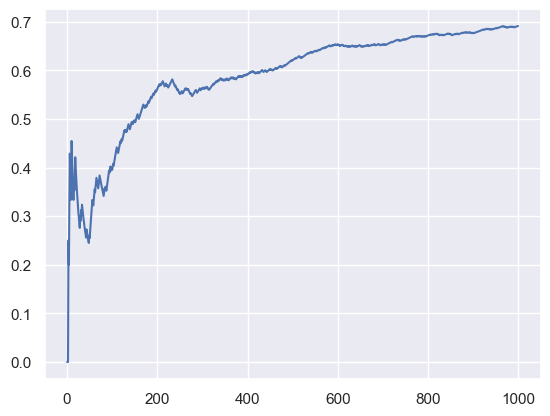
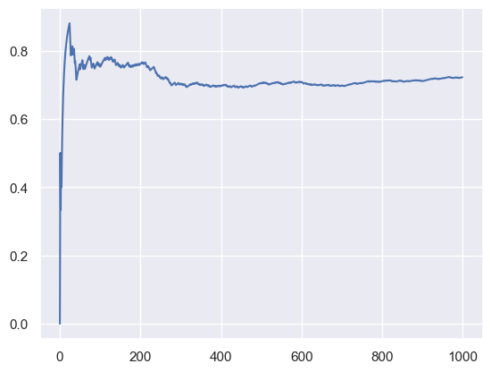
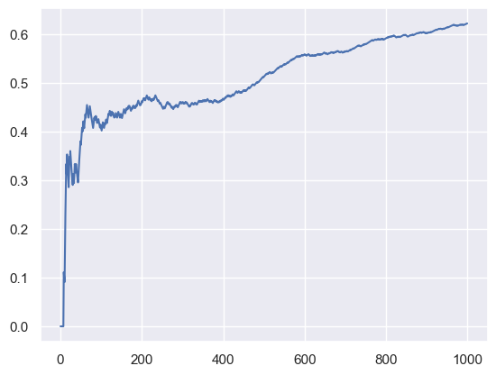

```python
import os

import matplotlib.pyplot as plt
import numpy as np
import pandas as pd
import seaborn as sns
from scipy.sparse import csr_matrix
from tqdm.autonotebook import tqdm

import bandit.environment as env
from bandit.policy import EGreedy, Softmax
from bandit.tensorflow import NeuralBandit, NeuralPerArmBandit, create_models

sns.set_theme()
```

    /var/folders/7m/74_ct3hx33d878n626w1wxyc0000gn/T/ipykernel_60854/1213398807.py:5: DeprecationWarning: 
    Pyarrow will become a required dependency of pandas in the next major release of pandas (pandas 3.0),
    (to allow more performant data types, such as the Arrow string type, and better interoperability with other libraries)
    but was not found to be installed on your system.
    If this would cause problems for you,
    please provide us feedback at https://github.com/pandas-dev/pandas/issues/54466
            
      import pandas as pd
    /var/folders/7m/74_ct3hx33d878n626w1wxyc0000gn/T/ipykernel_60854/1213398807.py:8: TqdmWarning: IProgress not found. Please update jupyter and ipywidgets. See https://ipywidgets.readthedocs.io/en/stable/user_install.html
      from tqdm.autonotebook import tqdm
    2024-02-06 13:36:09.853184: I tensorflow/core/platform/cpu_feature_guard.cc:182] This TensorFlow binary is optimized to use available CPU instructions in performance-critical operations.
    To enable the following instructions: AVX2 FMA, in other operations, rebuild TensorFlow with the appropriate compiler flags.


```python
import importlib

import bandit

importlib.reload(bandit)
importlib.reload(bandit.tensorflow)
```


    <module 'bandit.tensorflow' from '/Users/alextanhongpin/Documents/python/python-bandit/bandit/tensorflow.py'>


```python
import keras

keras.__version__
```


    '2.15.0'


```python
N = 1000


def run_simulation(bandit, policy, n=N, dynamic=False):
    total_reward = 0
    avg_rewards = []
    rng = np.random.RandomState(42)

    for i in tqdm(range(n), disable=False):
        state = env.observe(rng)

        # 1. Predict the action.
        rewards = bandit.pull(state)

        action = policy(rewards)

        # 2. Act and get the reward.
        if dynamic and i > n // 2:
            get_cost = env.get_cost_new
        else:
            get_cost = env.get_cost
        reward = get_cost(state, env.actions[action])
        # Change reward to 0 or 1 instead of -1 or 1

        # 3. Update the model.
        bandit.update(state, action, reward)

        # 4. Save the reward.
        total_reward += max(0, reward)
        avg_rewards.append(total_reward / (i + 1))
    return avg_rewards, total_reward


expected = [
    ({"user": "Tom", "time_of_day": "morning"}, "politics"),
    ({"user": "Tom", "time_of_day": "afternoon"}, "music"),
    ({"user": "Anna", "time_of_day": "morning"}, "sports"),
    ({"user": "Anna", "time_of_day": "afternoon"}, "politics"),
]


def debug_bandit(bandit):
    for i, act in enumerate(env.actions):
        print(i, act)
    print()
    policy = EGreedy(epsilon=0.0)

    for state, want in expected:
        rewards = bandit.pull(state)
        got = env.actions[policy(rewards)]
        if got != want:
            encoded = bandit.preprocess.transform(
                [env.feature_interaction(state, env.actions.index(want))]
            ).toarray()
            print(
                f"state({state}): got {got} ({env.actions.index(got)}), want {want} ({env.actions.index(want)})"
            )
            print(f"encoded {encoded}")
            print(f"rewards {np.round(rewards, 2)}, {np.argmax(rewards)}")
            print()
```

## Neural Bandit - Static


```python
policy = EGreedy(epsilon=0.0)
bandit = NeuralBandit(n_arms=len(env.actions), batch=1)

avg_rewards, total_reward = run_simulation(bandit, policy, n=N, dynamic=False)
```

    100%|██████████████████████████████████████████████████████████████████████████████████████████████████████████████| 1000/1000 [02:04<00:00,  8.06it/s]


```python
total_reward
```


    691.0


```python
debug_bandit(bandit)
```

    0 politics
    1 sports
    2 music
    3 food
    4 finance
    5 health
    6 camping
    
    state({'user': 'Tom', 'time_of_day': 'afternoon'}): got finance (4), want music (2)
    encoded [[-1.  0.  1.  0.  1.  0. -1. -1.]]
    rewards [0. 0. 0. 0. 0. 0. 0.], 4
    


```python
plt.plot(range(N), avg_rewards)
```


    [<matplotlib.lines.Line2D at 0x1348239d0>]


    

    


## Neural Bandit - Dynamic


```python
policy = EGreedy(epsilon=0.0)
bandit = NeuralBandit(n_arms=len(env.actions), batch=1)

avg_rewards, total_reward = run_simulation(bandit, policy, n=N, dynamic=True)
```

    100%|██████████████████████████████████████████████████████████████████████████████████████████████████████████████| 1000/1000 [02:04<00:00,  8.04it/s]


```python
total_reward
```


    722.0


```python
plt.plot(range(N), avg_rewards)
```


    [<matplotlib.lines.Line2D at 0x133e7e0b0>]


    

    


```python
debug_bandit(bandit)
```

    0 politics
    1 sports
    2 music
    3 food
    4 finance
    5 health
    6 camping
    
    state({'user': 'Tom', 'time_of_day': 'afternoon'}): got camping (6), want music (2)
    encoded [[-1.  0.  1.  0.  1.  0. -1. -1.]]
    rewards [0. 0. 0. 0. 0. 0. 0.], 4
    
    state({'user': 'Anna', 'time_of_day': 'afternoon'}): got sports (1), want politics (0)
    encoded [[-1.  0. -1.  0.  0.  0. -1.  0.]]
    rewards [0. 0. 0. 0. 0. 0. 0.], 1
    


Why is the tensorflow version performing worse than the scikit-learn MultiLayerPerceptron? The example has been modified to ue the `one_hot_encoding` instead of `feature_interaction`, but the result is still the same.

How about the pytorch version?

## Per-arm Bandit


```python
policy = EGreedy(epsilon=0.0)
bandit = NeuralPerArmBandit(batch=1, models=create_models(len(env.actions)))

avg_rewards, total_reward = run_simulation(bandit, policy, n=N, dynamic=False)
```

      0%|                                                                                                                         | 0/1000 [00:00<?, ?it/s]

    WARNING:tensorflow:5 out of the last 2012 calls to <function Model.make_predict_function.<locals>.predict_function at 0x1347ea200> triggered tf.function retracing. Tracing is expensive and the excessive number of tracings could be due to (1) creating @tf.function repeatedly in a loop, (2) passing tensors with different shapes, (3) passing Python objects instead of tensors. For (1), please define your @tf.function outside of the loop. For (2), @tf.function has reduce_retracing=True option that can avoid unnecessary retracing. For (3), please refer to https://www.tensorflow.org/guide/function#controlling_retracing and https://www.tensorflow.org/api_docs/python/tf/function for  more details.
    WARNING:tensorflow:6 out of the last 2013 calls to <function Model.make_predict_function.<locals>.predict_function at 0x1347ea8c0> triggered tf.function retracing. Tracing is expensive and the excessive number of tracings could be due to (1) creating @tf.function repeatedly in a loop, (2) passing tensors with different shapes, (3) passing Python objects instead of tensors. For (1), please define your @tf.function outside of the loop. For (2), @tf.function has reduce_retracing=True option that can avoid unnecessary retracing. For (3), please refer to https://www.tensorflow.org/guide/function#controlling_retracing and https://www.tensorflow.org/api_docs/python/tf/function for  more details.


    100%|██████████████████████████████████████████████████████████████████████████████████████████████████████████████| 1000/1000 [01:29<00:00, 11.23it/s]


```python
total_reward
```


    622.0


```python
plt.plot(range(N), avg_rewards)
```


    [<matplotlib.lines.Line2D at 0x134f25480>]


    

    


```python
debug_bandit(bandit)
```

    0 politics
    1 sports
    2 music
    3 food
    4 finance
    5 health
    6 camping
    
    state({'user': 'Tom', 'time_of_day': 'afternoon'}): got politics (0), want music (2)
    encoded [[-1.  0.  1.  0.  1.  0. -1. -1.]]
    rewards [0.98 0.09 0.06 0.27 0.15 0.35 0.53], 0
    


```python

```
