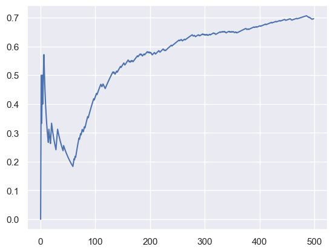
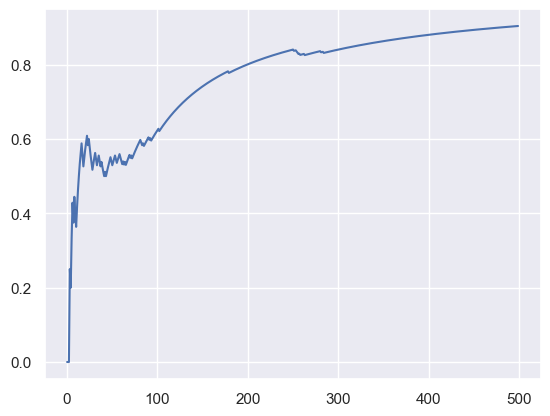

```python
import os

import matplotlib.pyplot as plt
import numpy as np
import pandas as pd
import seaborn as sns
import torch
from tqdm.autonotebook import tqdm

import bandit.environment as env
from bandit.policy import EGreedy, Softmax
from bandit.torch import NeuralBandit, NeuralPerArmBandit, create_model

sns.set_theme()
```

    /var/folders/7m/74_ct3hx33d878n626w1wxyc0000gn/T/ipykernel_22375/2096907171.py:8: TqdmExperimentalWarning: Using `tqdm.autonotebook.tqdm` in notebook mode. Use `tqdm.tqdm` instead to force console mode (e.g. in jupyter console)
      from tqdm.autonotebook import tqdm


```python
N = 500
```


```python
def run_simulation(bandit, policy=EGreedy(epsilon=0.0), n=N, dynamic=False):
    total_reward = 0
    avg_rewards = []
    rng = np.random.RandomState(42)

    for i in tqdm(range(n), disable=False):
        state = env.observe(rng)

        # 1. Predict the action.
        rewards = bandit.pull(state)

        action = policy(rewards)

        # 2. Act and get the reward.
        if dynamic and i > n // 2:
            get_cost = env.get_cost_new
        else:
            get_cost = env.get_cost
        reward = get_cost(state, env.actions[action])
        # Change reward to 0 or 1 instead of -1 or 1

        # 3. Update the model.
        bandit.update(state, action, reward)

        # 4. Save the reward.
        total_reward += max(0, reward)
        avg_rewards.append(total_reward / (i + 1))
    return avg_rewards, total_reward
```


```python
bandit = NeuralBandit(n_arms=len(env.actions), batch=1)
avg_rewards, total_reward = run_simulation(bandit)
total_reward
```


      0%|          | 0/500 [00:00<?, ?it/s]


    307.0


```python
plt.plot(range(N), avg_rewards)
```


    [<matplotlib.lines.Line2D at 0x12649c1c0>]


    

    


```python
bandit = NeuralBandit(n_arms=len(env.actions), batch=1)
avg_rewards, total_reward = run_simulation(bandit, dynamic=True)
total_reward
```


      0%|          | 0/500 [00:00<?, ?it/s]


    156.0


```python
plt.plot(range(N), avg_rewards)
```


    [<matplotlib.lines.Line2D at 0x1264fa950>]


    

    


## Neural Per Arm Bandit - Static


```python
bandit = NeuralPerArmBandit()
avg_rewards, total_reward = run_simulation(bandit)
total_reward
```


      0%|          | 0/500 [00:00<?, ?it/s]


    462.0


```python
plt.plot(range(N), avg_rewards)
```


    [<matplotlib.lines.Line2D at 0x126591660>]


    

    


## Neural Per Arm Bandit - Dynamic


```python
bandit = NeuralPerArmBandit()
avg_rewards, total_reward = run_simulation(bandit, dynamic=True)
total_reward
```


      0%|          | 0/500 [00:00<?, ?it/s]


    399.0


```python
plt.plot(range(N), avg_rewards)
```


    [<matplotlib.lines.Line2D at 0x126604f10>]


    

    


```python
# bandit = NeuralBandit(n_arms=len(env.actions), batch=1)

# bandit = NeuralPerArmBandit()

policy = EGreedy(epsilon=0.0)
rng = np.random.RandomState(42)

for i in range(1):
    state = env.observe(rng)

    rewards = bandit.pull(state)
    print("rewards", rewards)

    action = policy(rewards)

    reward = env.get_cost(state, env.actions[action])
    print("action", action)
    print("reward", reward)

    # 3. Update the model.

    bandit.update(state, action, reward)
```

    rewards [ 0.04031271  1.001804   -0.01953641 -0.11485421 -0.09468305 -0.11983435
     -0.09446142]
    action 1
    reward -1.0


## Conclusion

Per-arm bandit seems to be performing better, for unknown reasons. The feature-interaction doesn't seem to be doing its work when using torch or keras compared to scikit-learn's MLP.


```python

```
